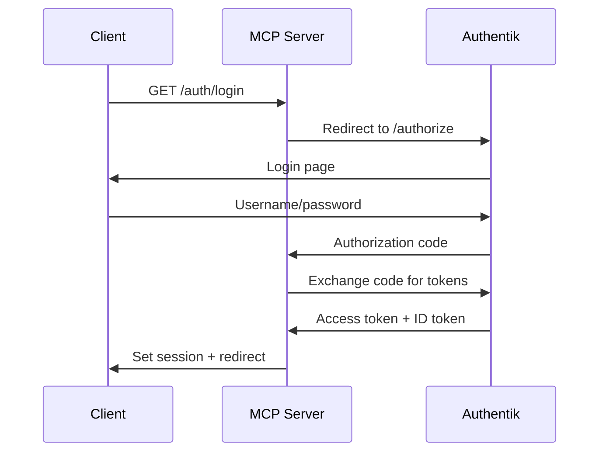
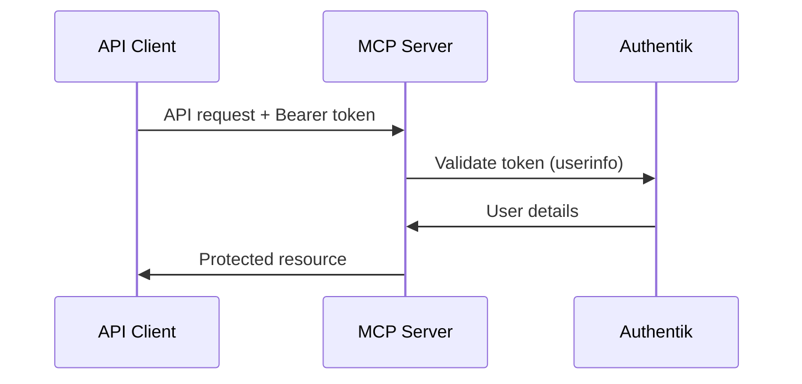

# @tylercoles/mcp-auth-authentik

Authentik OAuth2/OIDC authentication provider for MCP servers. This package provides seamless integration with Authentik for secure user authentication with full MCP authorization specification compliance.

## Features

- 🔐 **Full Authentik Integration** - OAuth2/OIDC with Authentik identity provider
- 🌐 **MCP Compliant** - Implements MCP authorization specification (RFC 9728)
- 🔄 **Dynamic Client Registration** - Automatic client registration for Claude.ai
- 👥 **Group-based Access Control** - Restrict access by Authentik groups
- 🎯 **Session Management** - Passport.js integration for web sessions
- 🔑 **Token Validation** - Bearer token authentication for API access

## Installation

```bash
npm install @tylercoles/mcp-auth-authentik
```

## Prerequisites

- Authentik server instance
- OAuth2/OIDC application configured in Authentik
- Client ID and optionally client secret

## Quick Start

```typescript
import { AuthentikAuth } from '@tylercoles/mcp-auth-authentik';
import { HttpTransport } from '@tylercoles/mcp-transport-http';
import { MCPServer } from '@tylercoles/mcp-server';

// Configure Authentik auth
const auth = new AuthentikAuth({
  url: 'https://auth.example.com',
  clientId: 'your-client-id',
  clientSecret: 'your-client-secret', // Optional for public clients
  redirectUri: 'https://mcp.example.com/auth/callback',
  scopes: ['openid', 'profile', 'email', 'groups']
});

// Create MCP server with Authentik auth
const server = new MCPServer({
  name: 'secure-mcp-server',
  version: '1.0.0'
});

const transport = new HttpTransport({
  port: 3000,
  auth: auth
});

server.useTransport(transport);
await server.start();
```

## Configuration

### Basic Configuration

```typescript
const auth = new AuthentikAuth({
  url: 'https://auth.example.com',           // Authentik server URL
  clientId: 'mcp-server-client',             // OAuth client ID
  clientSecret: 'optional-secret',           // Client secret (if confidential)
  redirectUri: 'https://mcp.example.com/auth/callback',
  applicationSlug: 'mcp-server',             // Authentik application slug
  scopes: ['openid', 'profile', 'email'],   // OAuth scopes
  sessionSecret: 'secure-session-secret'     // Session encryption key
});
```

### Group-based Access Control

Restrict access to specific Authentik groups:

```typescript
const auth = new AuthentikAuth({
  url: 'https://auth.example.com',
  clientId: 'mcp-server-client',
  allowedGroups: ['mcp-users', 'developers', 'admins'], // Only these groups allowed
  // ... other config
});
```

### Dynamic Client Registration

For environments requiring dynamic registration:

```typescript
const auth = new AuthentikAuth({
  url: 'https://auth.example.com',
  clientId: 'mcp-server-client',
  registrationApiToken: 'authentik-api-token', // For dynamic registration
  // ... other config
});
```

## Authentication Methods

### 1. Session-based (Web UI)

For web interfaces using cookies and sessions:

```typescript
// User visits /auth/login -> redirected to Authentik
// After auth: /auth/callback -> sets session
// Subsequent requests use session cookies

app.get('/protected', authMiddleware, (req, res) => {
  const user = req.user;
  res.json({ message: `Welcome ${user.username}!` });
});
```

### 2. Bearer Token (API)

For API access using OAuth access tokens:

```typescript
// Client obtains token via OAuth flow
// API requests include: Authorization: Bearer <token>

const response = await fetch('/api/data', {
  headers: {
    'Authorization': `Bearer ${accessToken}`
  }
});
```

## OAuth Flows

### Authorization Code Flow

Standard OAuth2 flow for web applications:



### API Token Flow

For programmatic access:



## MCP Authorization Compliance

### Discovery Endpoints

Automatically provides MCP-required endpoints:

```typescript
// GET /.well-known/oauth-protected-resource
{
  "resource": "https://mcp.example.com",
  "authorization_servers": ["https://auth.example.com/application/o/mcp-server/"]
}

// GET /.well-known/oauth-authorization-server  
{
  "issuer": "https://auth.example.com/application/o/mcp-server/",
  "authorization_endpoint": "https://auth.example.com/application/o/authorize/",
  "token_endpoint": "https://auth.example.com/application/o/token/",
  "userinfo_endpoint": "https://auth.example.com/application/o/userinfo/",
  // ... other metadata
}
```

### Dynamic Client Registration

Special handling for Claude.ai:

```typescript
// POST /application/o/register/
{
  "client_name": "claudeai",
  "redirect_uris": ["https://claude.ai/chat/..."]
}

// Response:
{
  "client_id": "your-configured-client-id",
  "client_secret": "",
  "redirect_uris": ["https://claude.ai/chat/..."],
  // ... other registration data
}
```

## User Information

Authentik user data is mapped to the standard User interface:

```typescript
{
  id: "authentik-user-id",           // Authentik user UUID
  username: "user@example.com",      // Username or email
  email: "user@example.com",         // Email address
  groups: ["group1", "group2"],      // Authentik groups
  name: "Full Name",                 // Display name
  given_name: "First",               // First name
  family_name: "Last",               // Last name
  email_verified: true               // Email verification status
}
```

## Routes

The provider automatically sets up authentication routes:

- `GET /auth/login` - Initiate OAuth flow
- `GET /auth/callback` - OAuth callback handler
- `POST /auth/logout` - Logout and clear session
- `GET /auth/user` - Get current user info
- `GET /auth/error` - Authentication error page

## Token Management

### Token Refresh

```typescript
const newTokens = await auth.refreshToken(refreshToken);
// Returns: { accessToken, refreshToken, tokenType, expiresIn }
```

### Token Revocation

```typescript
await auth.revokeToken(accessToken, 'access_token');
await auth.revokeToken(refreshToken, 'refresh_token');
```

### Token Verification

```typescript
const user = await auth.verifyToken(accessToken);
// Returns user object or null if invalid
```

## Error Handling

### Authentication Errors

```typescript
try {
  const user = await auth.authenticate(req);
} catch (error) {
  if (error.message === 'User not in allowed groups') {
    // Handle group restriction
  }
  // Handle other auth errors
}
```

### Token Errors

```typescript
const user = await auth.verifyToken(token);
if (!user) {
  // Token is invalid or expired
  return res.status(401).json({ error: 'Invalid token' });
}
```

## Integration Examples

### With Express

```typescript
import express from 'express';
import session from 'express-session';
import { AuthentikAuth } from '@tylercoles/mcp-auth-authentik';

const app = express();

// Configure session middleware
app.use(session({
  secret: 'session-secret',
  resave: false,
  saveUninitialized: false,
  cookie: { secure: process.env.NODE_ENV === 'production' }
}));

// Setup Authentik auth
const auth = new AuthentikAuth({ /* config */ });
await auth.initialize();

// Setup auth routes
const router = express.Router();
auth.setupRoutes(router);
app.use(router);
```

### With MCP Server

```typescript
import { MCPServer } from '@tylercoles/mcp-server';
import { HttpTransport } from '@tylercoles/mcp-transport-http';
import { AuthentikAuth } from '@tylercoles/mcp-auth-authentik';

const server = new MCPServer({
  name: 'secure-server',
  version: '1.0.0'
});

// Add protected tools
server.registerTool('secure-operation', {
  description: 'Requires authentication',
  inputSchema: { data: z.string() }
}, async ({ data }, context) => {
  // context.user contains authenticated user
  return {
    content: [{
      type: 'text',
      text: `Processing ${data} for user ${context.user?.username}`
    }]
  };
});

const transport = new HttpTransport({
  port: 3000,
  auth: new AuthentikAuth({ /* config */ })
});

server.useTransport(transport);
```

## Security Best Practices

- **HTTPS Only**: Always use HTTPS in production
- **Secure Sessions**: Use secure session configuration
- **Group Validation**: Implement proper group-based access control
- **Token Storage**: Store refresh tokens securely
- **CSRF Protection**: Enable CSRF protection for session-based auth
- **Rate Limiting**: Implement rate limiting on auth endpoints

## Troubleshooting

### Common Issues

1. **"Not authenticated"**: Check Authentik application configuration
2. **"User not in allowed groups"**: Verify user group memberships
3. **"Token validation failed"**: Check token expiration and audience
4. **"Discovery failed"**: Verify Authentik URL and application slug

### Debug Logging

```typescript
// Enable debug logging
process.env.DEBUG = 'authentik-auth:*';

const auth = new AuthentikAuth({
  // config
});
```

## License

MIT
